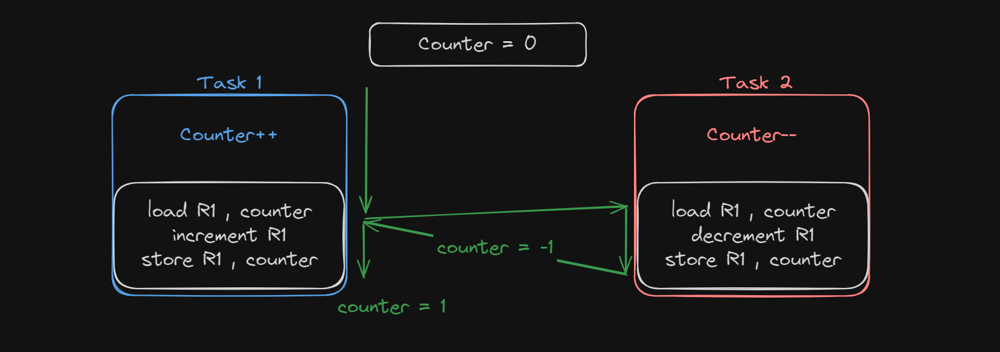
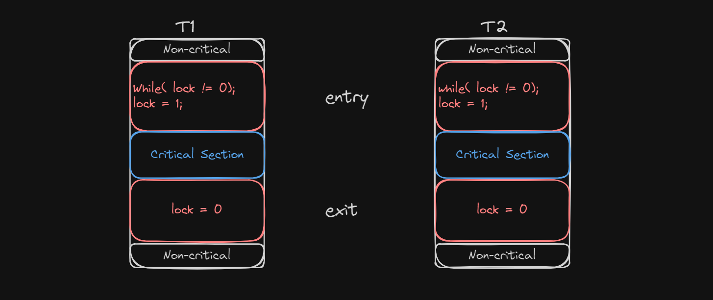
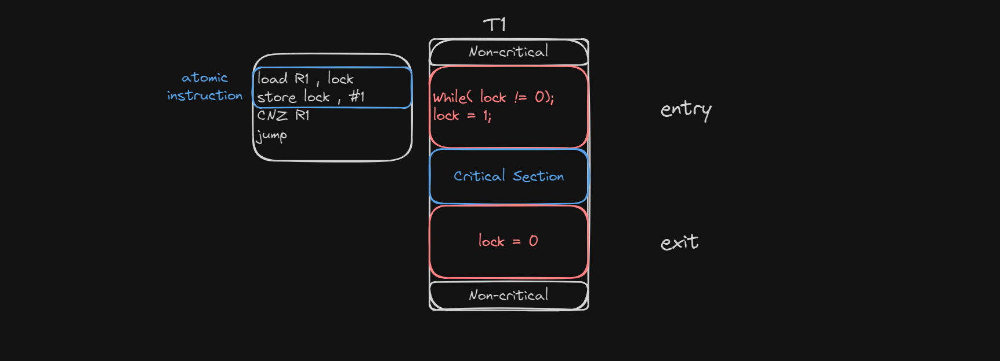
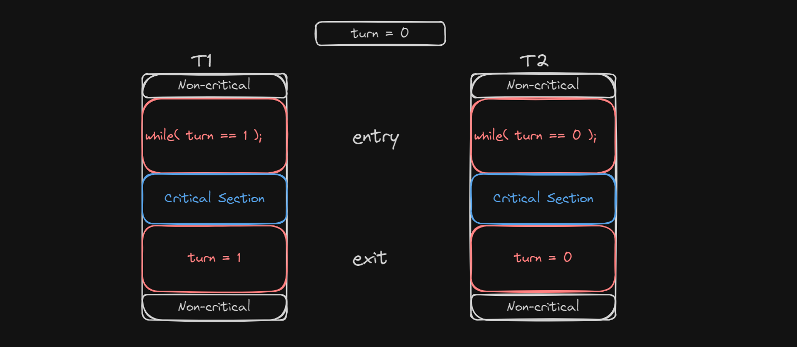
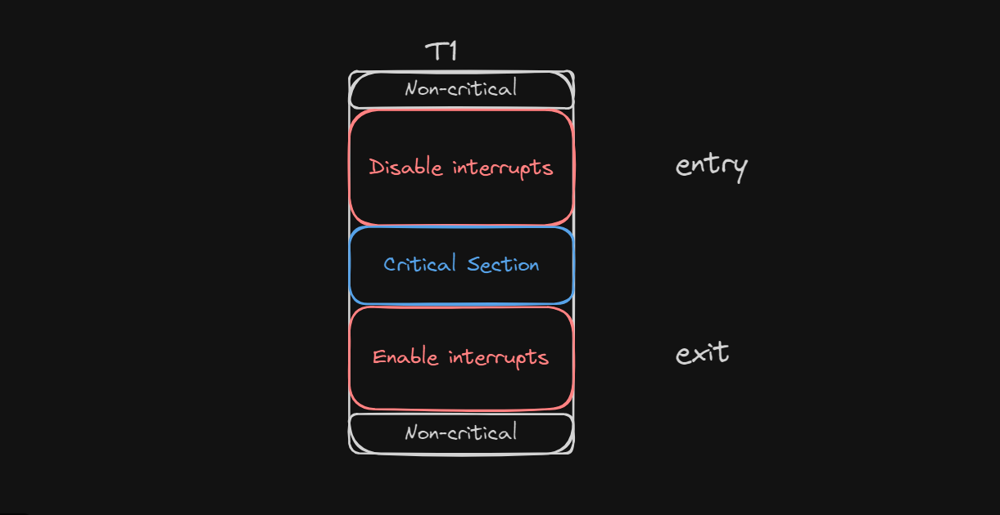

# Process Syncronization

Two tasks can typically communicate through a shared resource (shared memory). The section of code that accesses this memory will be called `critical section (CS)`, while the rest of the code will be called `non-critical`.

in an example where `counter` is a shared resource between `T1` and `T2`, which are preemptive, the scenario is as follows:

1. `T1` starts and takes a copy of `counter` with value `0`
2. `T2` interrupts and takes a copy of `counter` with value `0` too
3. `T2` decrements to `-1` and stores the value
4. `T2` is done, so `T1` returns to continue execution and increments old copy of `counter` to `1`
5. `T1` stores `counter` value as `1` instead of `0` (data corruption)

for every `CS` in code, there exists an `entry section` and `exit section` for protection and to ensure that the code works and accesses shared resources correctly and safely.

## methods for sync

1. busy wait
2. non-busy wait (generic method)

## Evaluation parameters for each method

1. **Mutual Exclusion:** No 2 processes are executing `CS`'s at the same time.

1. **Progress:** No task is blocked from entering a `CS` by a task that's in a `non-critical section`.

1. **Bounded limit:** Limiting number of `CS` re-entry times per task to avoid endless `CS` entry by a single task and infinite blocking for the others (starvation)

## Busy Wait Methods

### 1. Lock Variable

|Evaluation parameter | Status | Cause
|---------|----------|---------
|**Mutual Exclusion** | fail `:(` | `lock` is a variable treated like first scenario, so an interruption can occur between `while` and locking `lock = 1` and data corruption of `lock` which leads to multiple tasks at `CS` at the same time
|**Progress**| success `:)` |
|**Bounded limit** | fail `:(` | no limit to each task's entry

|Pros | Drawbacks
|---------|----------
| HW independent | busy wait method
| handle multiple processes |

### 2. Test & Set (T&S)

load and store instructions are combined into 1 new atomic assembly instruction (no interruption can occur in between). This allows the reading of `lock` flag and locking it just incase until condition evaluation complete.

|Evaluation parameter | Status | Cause
|---------|----------|---------
|**Mutual Exclusion** | success `:)` |
|**Progress**| success `:)` |
|**Bounded limit** | fail `:(` | no limit to each task's entry

|Pros | Drawbacks
|---------|----------
| multiple processes | busy wait method
|  | needs HW support, if not supported can be implemented by reordering assembly instructions

`T&S` is supported by most HW, by locking data bus.

### 3. Strict Alternative

Tasks take turns executing critical sections, on condition that a process ca't execute it's `CS` unless the other process took its turn.

|Evaluation parameter | Status | Cause
|---------|----------|---------
|**Mutual Exclusion** | success `:)` |
|**Progress**| fail `:(` | `T2` can't execute unless `T1` executed once first
|**Bounded limit** | success `:)` |

|Pros | Drawbacks
|---------|----------
| HW independent | busy wait method
|  | 2 processes only

### X. Disable all Interrupts

not really used as a method because disabling interrupts would mean killing the `OS`. (tasks are non-preemptive?)

### 4. Interested Variable

### 5. Peterson

## Non-Busy wait methods

### 1.1 Semaphore

### 1.2 Counter Semaphore
